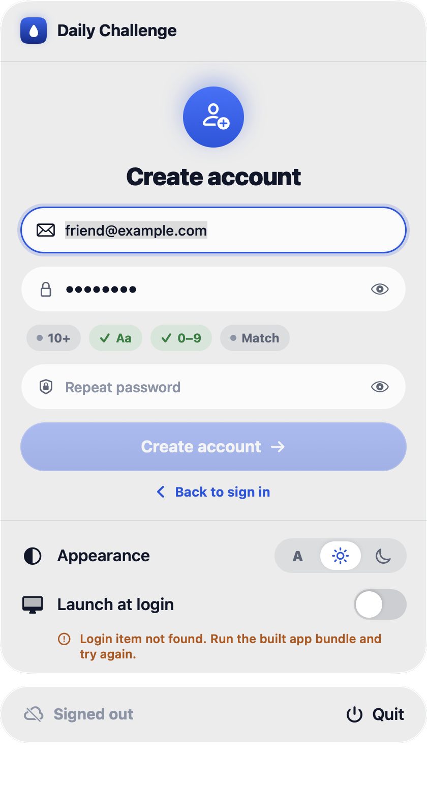
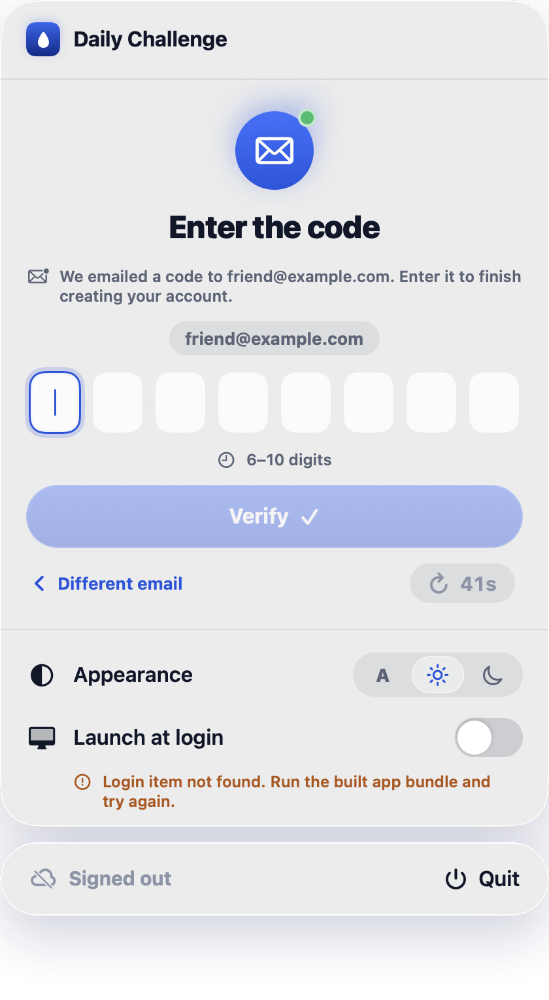
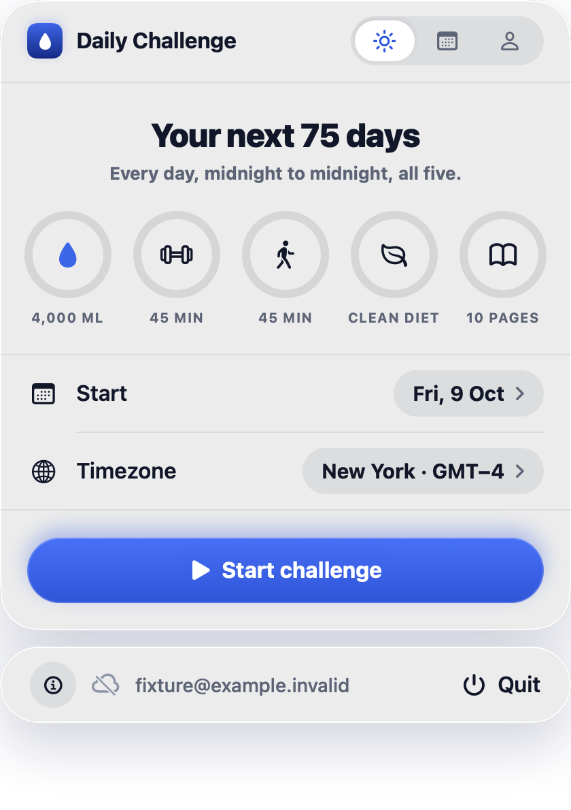

# Daily Challenge for Mac: getting started

Daily Challenge lives in your Mac's menu bar and tracks the five daily habits: 4 litres of water, a 45-minute workout, a 45-minute walk, a clean diet and 10 pages of Bible reading. It needs a Mac running macOS 14 or later.

> **Note for whoever shares this guide:** send the notarized `build/DailyChallenge.zip` made by `bash scripts/build-proof.sh` (not an `--adhoc` build). The steps below assume that build.

## 1. Download

Open the link Niko sent you and download `DailyChallenge.zip`. [Screenshot: Safari download arrow with the zip]

## 2. Install

In Downloads, double-click the zip. A **Daily Challenge** app appears. Drag it into your **Applications** folder. [Screenshot: dragging the app onto Applications]

## 3. Open it

Double-click **Daily Challenge** in Applications. Your Mac says it was downloaded from the internet and names the developer. Click **Open**. [Screenshot: the "downloaded from the internet" dialog]

A small water-drop icon appears at the top right of your screen, next to the clock. There is no Dock icon; that is normal. [Screenshot: menu bar with the drop icon circled]

## 4. Create your account

1. Click the drop, then **Create an account**.
2. Enter your email, choose a password (at least 6 characters) and type it again. Click **Create account**.
3. Check your email for a message from Daily Challenge with a 6-digit code. Type the code into the app and click **Confirm**. If it hasn't arrived after a minute, check your spam folder, then click **Resend code**.

You are now signed in. Use the same email and password if you install the app on another Mac.

## 5. Start your challenge

Pick your start date (today is fine). Check the **Time zone**: it starts as your Mac's, and each challenge day runs midnight to midnight there. To change it, click it and type your city. You can't change the start date or time zone later, so pick the place you'll mostly be. Then click **Start challenge**.

You will see the water jug and the five daily items. [Screenshot: Today tab]

## 6. Optional, recommended

Click **Account**:

- Turn on **Launch at login on this Mac** so the app is always there.
- Turn on **Water reminders on this Mac** if you want nudges, and click **Allow** when your Mac asks about notifications.

[Screenshot: Account tab]

## Updates

You only install by hand once. Daily Challenge checks for new versions once a day. When there is one, a **Software Update** window appears: click **Install Update**, and the app replaces itself and reopens. Your account, history and settings stay as they are. You can also check at any time: click the drop, then **Account**, and under **About** click **Check for updates**. If a new version was found while you were busy, the About section says so; click **Install update**.

If you installed a copy before automatic updates were added (version 0.2.0 or earlier), install the new download from Niko once in the same way as above, replacing the old app; after that, updates arrive by themselves.

## Every day

Click the drop, press **+450 ml** for each glass, and tick workout, walk, diet and Bible reading. All five done means the day counts. Miss one and the streak restarts. The **History** tab lets you fix a day you forgot to log.

## Forgot your password?

Click the drop, then **Forgot password?**. Enter your email and click **Send code**. Type the 6-digit code from the email, choose a new password, and click **Save password and sign in**.

## If something goes wrong

Send Niko a screenshot. You never need to change any security settings.

## If you were given a development build

Niko may occasionally send a test copy that is not notarized. Your Mac will then say it "could not verify" Daily Challenge: click **Done**, open **System Settings → Privacy & Security**, scroll to **Security**, click **Open Anyway** next to Daily Challenge, enter your Mac password and click **Open** (within an hour of the first attempt, and again after each such copy). If **Launch at login** says "Requires approval", allow Daily Challenge in **System Settings → General → Login Items**. Never turn off Gatekeeper or run Terminal commands to get around this; ask Niko for the regular download instead.
